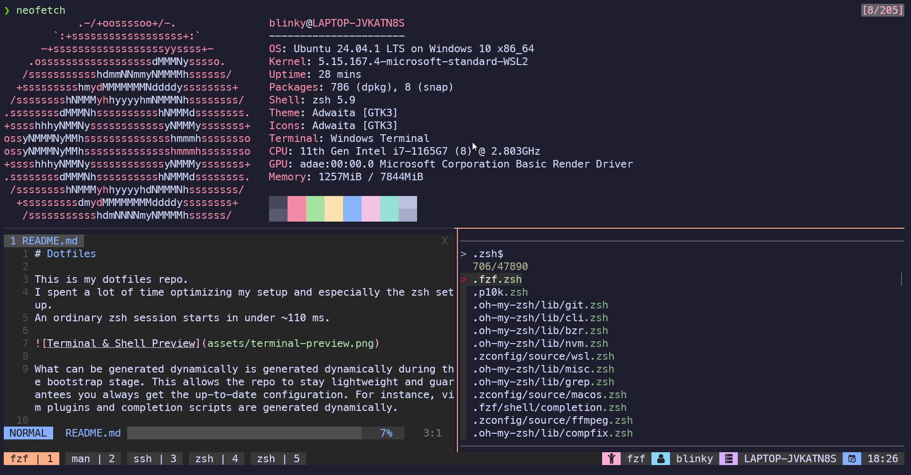

# Dotfiles

This is my dotfiles repo.
I spent a lot of time optimizing my setup and especially the zsh setup.
An ordinary zsh session starts in under ~110 ms.



The terminal of my choice is the brand new [Windows Terminal](https://github.com/microsoft/terminal). The color theme of my choice is [Catppuccin](https://github.com/catppuccin) (Mocha). I use it both for the [terminal](https://github.com/catppuccin/windows-terminal) (you need to install it manually) and [tmux](https://github.com/catppuccin/tmux) (already configured).

What can be generated dynamically is generated dynamically during the bootstrap stage. This allows the repo to stay lightweight and guarantees you always get the up-to-date configuration. For instance, vim plugins and completion scripts are generated dynamically.

Basic overview of the essential utils I personally use daily:
- [zsh](https://www.zsh.org/) - shell. Configured to work in a vim mode
- [vim](https://www.vim.org/) - editor. Comes with a bunch of useful plugins (inspect them all - [.vim/plugins.vim](../.vim/plugins.vim))
- [tmux](https://github.com/tmux/tmux) - terminal multiplexer
- [fzf](https://github.com/junegunn/fzf) - fuzzy finder
- [ripgrep](https://github.com/BurntSushi/ripgrep) - like `grep` but better
- [fd-find](https://github.com/sharkdp/fd) - like `find` but better
- [zoxide](https://github.com/ajeetdsouza/zoxide) - like `cd` but better
- [bat](https://github.com/sharkdp/bat) - like `cat` but better
- [jq](https://github.com/jqlang/jq) - json manipulation
- [delta](https://github.com/dandavison/delta) - git diff pager
- [ncdu](https://dev.yorhel.nl/ncdu) - file explorer

All of them are already preconfigured.

## Quick start

Execute the following:
```shell
curl -sSfLO https://raw.githubusercontent.com/blinky-z/dotfiles/refs/heads/main/install.sh && chmod u+x install.sh && ./install.sh
```

The bootstrap scripts, which you can find in [.config/yadm](../.config/yadm), will configure your shell and install all the required utils.
I recommend you to look at the scripts yourself and adjust the setup to your liking before running. High chances are you don't need everything I use.

After the bootstrap script finishes the job, please log out and log in again. Now, when opening a terminal, you should see Zsh inside a Tmux window.

> [!WARNING]
> Make sure to backup your home dir beforehand.
>
> This repo may overwrite your files upon installation.

